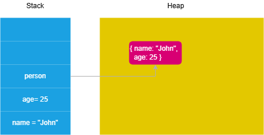

# 🔖 Section 1. Getting started
### What is JavaScript ?
JavaScript is a programming language.
It's used to make webpages dynamic and interactive. 
Currently it has reached to significant level that i can do anything like for server side programming it has ``` NodeJs``` for frontend it has ```ReactJs``` ```AngularJs``` and many more derivatives in every other domain.

It has ECMA standard. Provides the core funcionality like ```DOM``` ```BOM```.

JavaScript engines: ```V8``` in Chrome, ```SpiderMonkey``` in Firefox, and ```JavaScriptCore``` in Safari.

# 🔖 Section 2. Fundamentals
### Syntax
`Whitespace`:
Use whitespaces to format your code.
JS bundler removes all whitespaces from the javascript files and put them into single file for deployment, making js code fast and light to load.

`;`: to terminate statement.  
`{}`: for block.  
`// & /* */`: for single and multiline comment.  
`identifiers`: Names you choose for variables, functions, classes etc.  
`keywords`: reserved words (gives signals to interpreter / compiler).

### Variables  
Label that references a value.  

Use `let` and `const` to declare and initialize variables.  
`let` Blocked score and reassignable.  
`const` Blocked score and constant.  
Never ever use `var`, else you'll be fired.

`const name = "Chetan Kshirsagar";`

### Data Types
Answers : What kind of data are you working with ?

primitive  : `number` `bigint` `string` `boolean` `null` `undefined` `symbol`  
complex : `object`

### Numeric Separator
`const budget = 1000000000;`  
`const budget = 1_000_000_000;` Readable

### Primitive vs. Reference Values  
<!--    -->
JS stores primitive values on `stack`.
and  objects and functions on the `heap`.  

# 🔖 Section 3. Operators
Arithmetic : `+` `-` `*` `/` `%`  
Unary : `+X` `-X` `X++` `X--` `++X` `--X`  
Comparison : `<` `>` `<=` `>=` `==` `!=`  
Logical : `||` `&&` `!`

# 🔖 Section 4. Control flow Statements
`if`  `if...else`  `if...else...if`
### Ternary Operator  
`condition` ? `true` : `false`;
### switch
`replace multiple if statements`
### while
`runs as long as a specified condition is true`
### do-while
`executes code at least once`
### for
`can specify how many times it should run`
### break
`terminates a loop`
### continue
`skip the current iteraion`
### Comma Operator
`leftExpression, rightExpression` -  `Evaluates from left and returns from right`

# 🔖 Section 5. Functions  
Reusable block of code.  
`Functions are first-class citizens because it can be stored, passed and returned.`
```
function add(a, b) {
    return a + b; 
}
```
`arguments` is a array-like object, contains all the arguments.

 `Hoisting` means all the declarations are move to top of the code by interpreter.

 ### Anonymous Functions
 Function without a name. Lol
 ```
 (function () {
   //anonymous function + IIFE
})();
```
### Pass-By-Value & Pass-By-Reference
`JavaScript passes all arguments to a function by values.`

Argument's values get copied into parameters. `PBV`  
Argument's ref get assigned to params. `PB-Ref` 

### Recursive Function
`Function is a recursive function if it calls itself inside its body.`

# Section 6. Objects & Prototypes
`When a function is a property of an object, it becomes a method.`  

### Constructor Function
```
function Person(firstName, lastName) {
    this.firstName = firstName;
    this.lastName = lastName;
}
```
```
let person = new Person('John','Doe');
```
what `new` does ?  
Create a new empty object and assign it to the this variable.
Assign the arguments 'John' and 'Doe' to the firstName and lastName properties of the object.
Return the this value.


